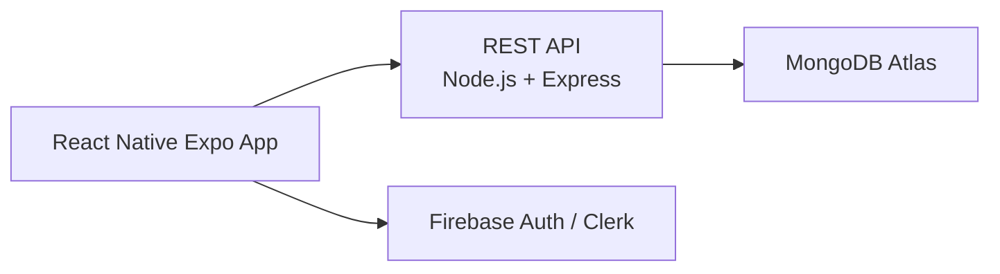
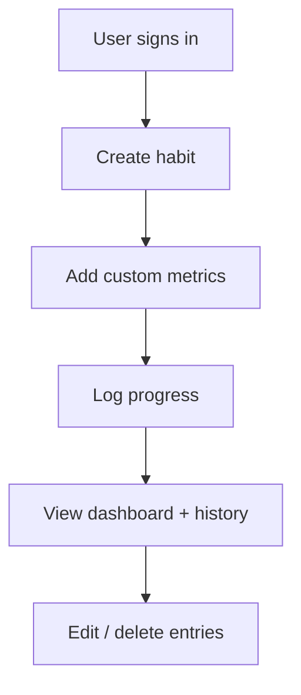
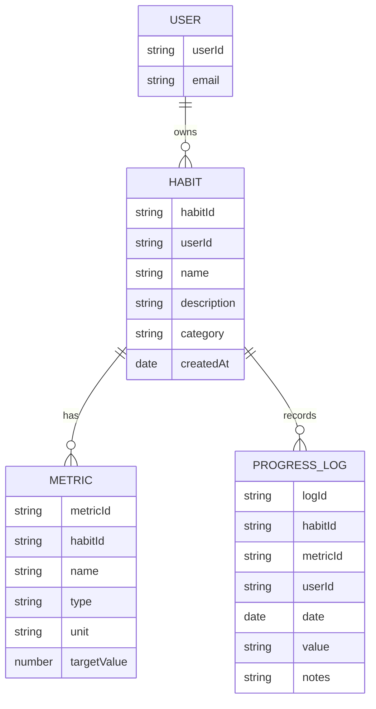

# Habit Tracker App

## Overview
A mobile habit tracker for Android that lets users create custom habits, define their own metrics, and log progress over time. The app is designed for a flexible MongoDB-backed backend and can be shipped as an Android APK through Expo.

## Product Goals
- Let users create multiple personal habits
- Let users define custom metrics per habit
- Track progress daily or over a chosen time range
- Maintain a clean dashboard for streaks and history
- Support future cloud sync and reminders

## Recommended Tech Stack
- Mobile: React Native + Expo
- Backend: Node.js + Express
- Database: MongoDB Atlas
- Auth: Firebase Auth or Clerk
- Deploy: Render or Railway
- Android delivery: Expo EAS Build

## System Architecture

## App Flow

## MongoDB Data Model

## Core Features
1. Create custom habits
2. Add multiple metrics per habit
3. Log daily progress and notes
4. Track streaks and completion history
5. Edit/delete habit and metric definitions
6. View summary dashboard

## MVP Scope
- Habit creation and editing
- Custom metric definition
- Daily progress tracking
- Dashboard for current status and history
- CRUD operations for data records

## Future Enhancements
- Notification reminders
- Charts and analytics
- Cross-device sync
- Achievement badges
- Team challenges or sharing

## Delivery Plan
1. Build Expo mobile app UI
2. Add authentication and API integration
3. Create Node.js API for CRUD operations
4. Use MongoDB Atlas for storage
5. Generate Android APK through Expo EAS Build

## Project Goal
The product should be flexible enough that users can define their own habits and metrics without changing app code for every new habit type.

If you want, I can next refine this into a more polished product README with:
- user stories
- API endpoint list
- folder structure
- a launch checklist